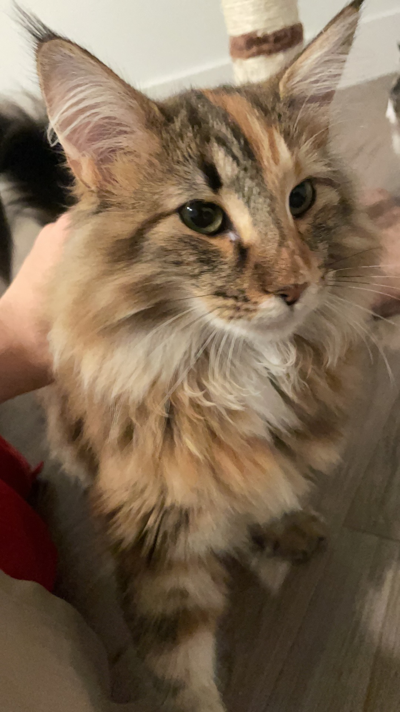

Figure 2. Dolly (front) and Dayko (back) judging Haoran's research presentation.

## Dolly and Dayko

Hello hello, we are Dolly and Dayko, twin sisters of Norwegian Forest Cats born on Jan 11, 2023.

We were Assistant Kittens at University of Lovely Cats, Europe (ULC Europe). In Jun 2023, we started new positions as Associate Kittens at the Department of Emotional Support, ULC US.

### Research Group

Our research focuses on nature-inspired algorithms that maximize human satisfaction. Dolly leads active playing project which investigates multimodal interactions without being annoying, while Dayko leads passive accompanying project which explores optimal lie-down-and-chill spots within human sight to provide continuous support. Both projects are granted by National Meow-Meow Foundation.

### Select Publications

    

        <!-- Content for the left column -->
        
        
        
        
        
        
        
        
        <!-- Add more images as needed -->
    

    

        <!-- Content for the right column -->
        
        
        
        
        
        
        
        
        
        <!-- Add more images as needed -->
    

